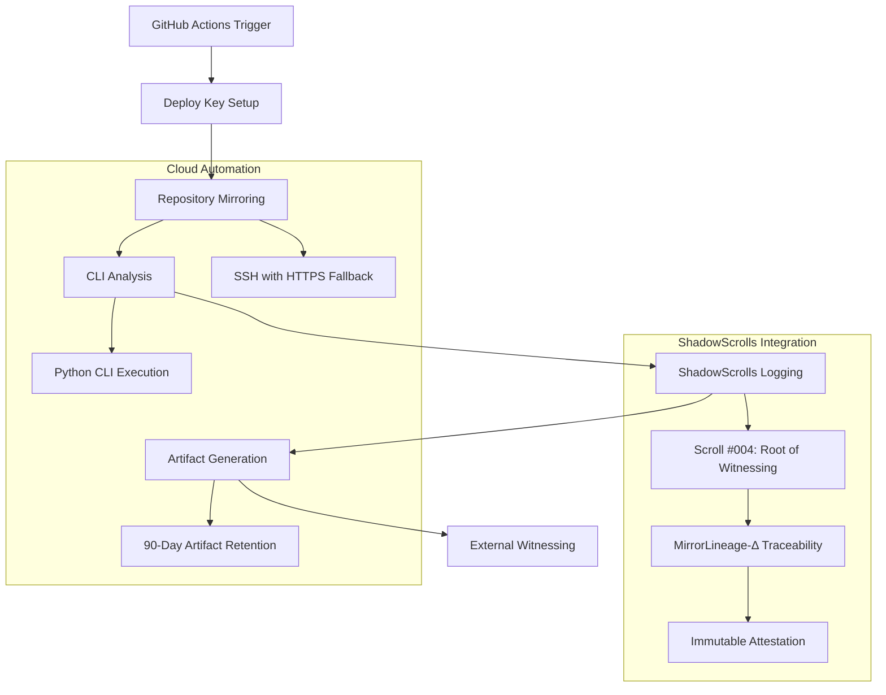

# 🔄 Triune Mirror Watcher - Sync Process Documentation

## 📖 Overview
This document provides detailed technical documentation for the Triune Mirror Watcher sync process, covering the complete automation pipeline from repository mirroring to ShadowScrolls attestation generation.

---

## 🏗️ System Architecture



---

## ⚙️ Process Flow

### 1. 🚀 Trigger Mechanisms

#### Daily Automatic Sync
- **Schedule**: 06:00 UTC daily
- **Cron Expression**: `0 6 * * *`
- **Default Repositories**: Configured in workflow
- **Zero Manual Intervention**: Fully automated

#### Manual Dispatch
- **Input**: JSON array of repositories `["owner/repo1", "owner/repo2"]`
- **Custom Branch**: Configurable output branch
- **ShadowScrolls Toggle**: Enable/disable attestation logging
- **On-Demand Execution**: Available 24/7

#### Push/PR Validation
- **Trigger Paths**: `mirror_watcher/**`, workflow files
- **Validation Only**: Tests CLI without mirroring
- **Quality Assurance**: Ensures changes don't break automation

### 2. 🔑 Authentication & Security

#### Deploy Key Generation
```bash
# Automated in GitHub Actions
ssh-keygen -t ed25519 -C "mirror-watcher@triune-oracle.com" -f deploy_key -N ""
chmod 600 deploy_key
chmod 644 deploy_key.pub
```

#### SSH Configuration
```bash
# GitHub host configuration
Host github.com
  HostName github.com
  User git
  StrictHostKeyChecking no
  UserKnownHostsFile /dev/null
```

#### HTTPS Fallback
- **Primary**: SSH with deploy keys
- **Fallback**: HTTPS for public repositories
- **Graceful Degradation**: Automatic retry mechanism

### 3. 🪞 Repository Mirroring

#### Clone Process
```bash
# SSH attempt
git clone --depth 1 git@github.com:owner/repo.git target_dir

# HTTPS fallback
git clone --depth 1 https://github.com/owner/repo.git target_dir
```

#### Security Features
- **Shallow Clone**: `--depth 1` for efficiency
- **Read-Only Access**: No write operations to source repositories
- **Temporary Storage**: Automatic cleanup after execution
- **Isolation**: Each repository processed independently

### 4. 🔍 CLI Analysis Pipeline

#### Python Environment Setup
```python
# Dependencies
import json
import subprocess
import tempfile
from pathlib import Path
from datetime import datetime, timezone

# Mirror Watcher modules
from mirror_watcher.cli import MirrorWatcherCLI
from mirror_watcher.analyzer import TriuneAnalyzer
```

#### Analysis Execution
```python
cli = MirrorWatcherCLI()
result = cli.run_complete_workflow(
    source_repo="owner/repo",
    output_dir="output",
    cleanup=True
)
```

#### Test Framework Detection
- **Python**: pytest, unittest
- **Node.js**: npm test script
- **Timeout**: 120 seconds per test suite
- **Result Capture**: stdout/stderr with size limits

---

## 📜 ShadowScrolls Integration

### 🔮 Scroll #004: Root of Witnessing

#### Core Metadata
```json
{
  "scroll_id": "#004",
  "title": "Root of Witnessing",
  "traceability": "MirrorLineage-Δ",
  "execution_id": "mirror-20250818-182934-12345",
  "timestamp": "2025-08-18T18:29:34.567Z"
}
```

#### Event Logging
```python
# Event structure
{
  "timestamp": "2025-08-18T18:29:34.567Z",
  "type": "MIRROR_START",
  "description": "Starting mirror of owner/repo",
  "data": {
    "target_dir": "/tmp/mirror_dir",
    "clone_url": "git@github.com:owner/repo.git"
  }
}
```

#### Traceability Chain
1. **Initialization**: CLI startup with unique execution ID
2. **Mirror Events**: Clone start/success/failure with metadata
3. **Analysis Events**: Repository analysis with metrics
4. **Test Events**: CLI test execution with results
5. **Completion**: Final attestation with summary

### 🔗 External Witnessing

#### GitHub Actions Immutable Logs
- **Public Audit Trail**: All executions logged in GitHub Actions
- **Tamper-Proof**: Logs cannot be modified after execution
- **Third-Party Verification**: GitHub provides independent witnessing
- **Retention**: GitHub's standard log retention policy

#### Attestation Structure
```json
{
  "scroll_id": "#004",
  "title": "Root of Witnessing",
  "traceability": "MirrorLineage-Δ",
  "execution_metadata": {
    "execution_id": "unique-id",
    "github_run_id": "12345",
    "workflow": "repo-file-sync",
    "timestamp": "2025-08-18T18:29:34Z",
    "runner_os": "Linux",
    "sha": "commit-hash"
  },
  "external_witnessing": {
    "github_actions": true,
    "immutable_logs": true,
    "public_attestation": true
  },
  "total_repositories_processed": 3,
  "successful_executions": 2,
  "failed_executions": 1
}
```

---

## 📊 Analysis Process

### 🔍 Repository Analysis

#### File System Analysis
```python
analysis = {
  "file_analysis": {
    "total_files": 150,
    "total_lines": 12500,
    "total_size": 2500000,
    "language_files": {"Python": [...], "JavaScript": [...]},
    "large_files": [...],
    "binary_files": [...]
  }
}
```

#### Language Distribution
```python
language_analysis = {
  "languages": {
    "Python": {
      "file_count": 25,
      "total_lines": 8000,
      "line_percentage": 64.0
    }
  },
  "primary_language": "Python",
  "language_count": 5
}
```

#### Quality Metrics
```python
quality_metrics = {
  "maintainability_score": 85,
  "documentation_ratio": 15.5,
  "complexity_indicators": {
    "directory_depth": 4,
    "average_file_size": 16666,
    "large_file_count": 3
  }
}
```

### 🧪 CLI Testing

#### Test Framework Detection
1. **Python Projects**:
   ```bash
   python -m pytest --version  # Check for pytest
   python -m unittest --help   # Fallback to unittest
   ```

2. **Node.js Projects**:
   ```bash
   npm test  # Execute package.json test script
   ```

#### Result Structure
```json
{
  "type": "python",
  "command": "python -m pytest",
  "success": true,
  "output": "collected 25 items\n25 passed",
  "error": null
}
```

---

## 🗄️ Artifact Management

### 📦 Artifact Types

#### Primary Artifacts
1. **Analysis Results**: `analysis_results.json`
2. **Test Results**: `test_results.json`
3. **ShadowScrolls Attestation**: `shadowscrolls_attestation_*.json`
4. **Execution Report**: `execution_report.md`

#### Metadata Artifacts
1. **Artifact Index**: `artifact_index.json`
2. **Execution Summary**: `execution_results.json`
3. **Job Summary**: GitHub Actions step summary

### 🔄 Storage & Retention

#### GitHub Actions Artifacts
- **Storage Duration**: 90 days
- **Compression**: Level 6 for optimal size/speed
- **Download Access**: Available via GitHub Actions UI
- **API Access**: GitHub REST API for programmatic access

#### Artifact Structure
```
artifacts/
├── analysis_results.json
├── test_results.json
├── shadowscrolls_attestation_mirror-20250818-182934-12345.json
├── execution_report.md
├── execution_results.json
└── artifact_index.json
```

---

## 🔧 Error Handling & Recovery

### ⚠️ Error Categories

#### Authentication Errors
- **SSH Key Issues**: Automatic fallback to HTTPS
- **Permission Denied**: Clear error messages with resolution steps
- **Network Timeouts**: Retry mechanism with exponential backoff

#### Repository Errors
- **Not Found**: Skip repository with logged error
- **Clone Failures**: Try HTTPS fallback, then mark as failed
- **Large Repositories**: Shallow clone with size limits

#### Analysis Errors
- **Binary Files**: Skip analysis, note in logs
- **Encoding Issues**: UTF-8 with ignore errors
- **Timeout**: 300-second limit per repository

### 🛡️ Recovery Mechanisms

#### Graceful Degradation
```python
try:
    result = mirror_repository(repo)
    if not result:
        logger.log_event("MIRROR_FAILED", f"Fallback attempted for {repo}")
        return try_https_fallback(repo)
except Exception as e:
    logger.log_event("MIRROR_EXCEPTION", f"Critical error: {str(e)}")
    return {"success": False, "error": str(e)}
```

#### Partial Success Handling
- **Continue on Error**: Process remaining repositories
- **Aggregate Results**: Collect all successes and failures
- **Detailed Reporting**: Include error details in attestation

---

## 📈 Monitoring & Observability

### 📊 Success Metrics

#### Execution Metrics
- **Success Rate**: Percentage of successful repository mirrors
- **Execution Time**: Total duration and per-repository timing
- **Artifact Size**: Generated artifact sizes and counts
- **Error Rate**: Frequency and types of errors

#### ShadowScrolls Metrics
- **Attestation Generation**: Success rate of attestation creation
- **Event Logging**: Number of events captured per execution
- **External Witnessing**: GitHub Actions log availability
- **Traceability**: Completeness of execution chain

### 🔍 GitHub Actions Integration

#### Step Summary Generation
```markdown
# 🪞 Mirror Watcher Execution Summary

## 📊 Results
- **Total Repositories:** 3
- **Successful:** 2
- **Failed:** 1

## 🎯 Features Verified
- ✅ Termux dependency eliminated
- ✅ All CLI operations in cloud runner
- ✅ ShadowScrolls logging automated
```

#### Workflow Status
- **Success**: All repositories processed successfully
- **Partial**: Some repositories failed but execution completed
- **Failure**: Critical error prevented completion

---

## 🔮 Future Enhancements

### 🚀 Planned Features

#### Advanced Analysis
- **Security Scanning**: Detect potential vulnerabilities
- **Dependency Analysis**: Check for outdated packages
- **Code Quality**: Static analysis integration
- **Performance Metrics**: Execution time optimization

#### Enhanced ShadowScrolls
- **Cryptographic Signatures**: Sign attestations with private keys
- **Blockchain Integration**: Store attestation hashes on-chain
- **Cross-Platform Witnessing**: Multiple external witness systems
- **Real-Time Monitoring**: Live execution status updates

#### Scalability Improvements
- **Parallel Processing**: Mirror multiple repositories simultaneously
- **Caching**: Cache analysis results for unchanged repositories
- **Incremental Sync**: Only process changed files
- **Resource Optimization**: Memory and CPU usage optimization

---

## 📞 Support & Troubleshooting

### 🔧 Debug Commands

#### Local Testing
```bash
# Test CLI locally
python -m mirror_watcher.cli Triune-Oracle/test-repo --verbose

# Validate imports
python -c "from mirror_watcher import cli_main, TriuneAnalyzer; print('OK')"

# Check GitHub workflow syntax
yamllint .github/workflows/repo-file-sync.yml
```

#### GitHub Actions Debugging
```bash
# Test workflow dispatch locally (requires act)
act workflow_dispatch --input source_repositories='["owner/repo"]'

# Validate workflow file
gh workflow view repo-file-sync.yml
```

### 📧 Contact & Support

#### Primary Contacts
- **Technical Issues**: Create GitHub issue with `mirror-watcher` label
- **Security Concerns**: Email security@triune-oracle.com
- **Feature Requests**: Use GitHub Discussions

#### Documentation Updates
- **Process Changes**: Update this document with version control
- **New Features**: Document in both checklist and process docs
- **Error Resolution**: Add troubleshooting steps to checklist

---

**🎊 The Triune Mirror Watcher sync process ensures complete automation, external witnessing, and zero manual intervention while maintaining the highest standards of security and observability. The future of CLI mirroring is here! ⚔️✨💰**