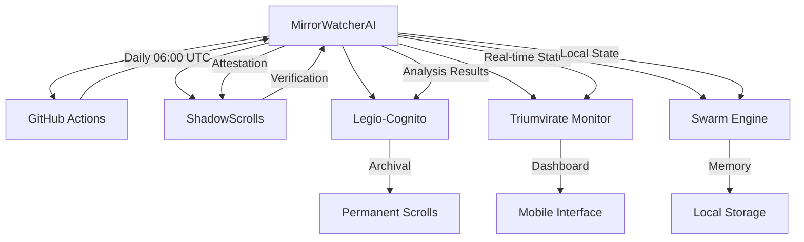

# 🔗 MirrorWatcherAI Integration Guide

Complete integration guide for the MirrorWatcherAI automation system with the Triune Oracle ecosystem.

## Architecture Overview



## Component Integration

### 1. GitHub Actions Integration

#### Workflow Configuration
```yaml
# .github/workflows/mirror-watcher-automation.yml
name: "🔍 MirrorWatcherAI Complete Automation"
on:
  schedule:
    - cron: '0 6 * * *'  # Daily at 06:00 UTC
  workflow_dispatch:     # Manual triggering
```

#### Environment Variables
```bash
# Required in GitHub Secrets
REPO_SYNC_TOKEN          # GitHub API access
SHADOWSCROLLS_ENDPOINT   # External attestation service
SHADOWSCROLLS_API_KEY    # Attestation authentication
LEGIO_COGNITO_ENDPOINT   # Scroll archival service
TRIUMVIRATE_MONITOR_ENDPOINT # Dashboard service
```

#### Execution Flow
1. **Environment Setup**: Python 3.11, dependencies installation
2. **Health Check**: Validate all system components
3. **Analysis Execution**: Parallel repository analysis
4. **Attestation Creation**: ShadowScrolls external witnessing
5. **Ecosystem Sync**: Integration with Triune services
6. **Artifact Storage**: 90-day retention with compression

### 2. ShadowScrolls Integration

#### Purpose
External attestation and immutable logging for cryptographic verification.

#### API Integration
```python
# Attestation creation
attestation = await shadowscrolls.create_attestation(
    session_id="analysis-20250819-060000",
    results=analysis_results,
    metadata={
        "system": "MirrorWatcherAI",
        "version": "1.0.0",
        "timestamp": "2025-08-19T06:00:00Z"
    }
)
```

#### Data Structure
```json
{
  "scroll_metadata": {
    "scroll_id": "#001 – MirrorWatcher Analysis",
    "session_id": "analysis-20250819-060000",
    "system": "MirrorWatcherAI Complete Automation System",
    "attestation_type": "repository_analysis"
  },
  "verification": {
    "content_hash": "sha256_hash_of_results",
    "signature": "hmac_sha256_signature",
    "merkle_root": "merkle_tree_root_hash"
  },
  "mirrorlineage_delta": {
    "enabled": true,
    "traceability_chain": "immutable_chain_metadata",
    "immutable_log_entry": "cryptographic_verification"
  }
}
```

#### Local Backup
- **Storage Path**: `.shadowscrolls/attestations/`
- **File Format**: `attestation-{number}-{timestamp}.json`
- **Verification**: Built-in integrity checking
- **Recovery**: Automatic retry with exponential backoff

### 3. Legio-Cognito Integration

#### Purpose
Automatic scroll archival for permanent retention of analysis results.

#### API Integration
```python
# Scroll archival
scroll_result = await triune.sync_to_legio_cognito(
    session_id="analysis-session",
    results=analysis_data
)
```

#### Scroll Data Structure
```json
{
  "scroll_type": "mirror_watcher_analysis",
  "session_id": "analysis-20250819-060000",
  "analysis_results": {
    "repositories": {...},
    "summary": {...},
    "metrics": {...}
  },
  "archival_metadata": {
    "retention_policy": "permanent",
    "classification": "analysis_data",
    "source": "mirror_watcher_automation"
  }
}
```

#### Features
- **Permanent Retention**: All analysis results preserved indefinitely
- **Immutable Storage**: Tamper-proof archival system
- **Classification Support**: Automatic data categorization
- **Search Capabilities**: Full-text search across archived scrolls

### 4. Triumvirate Monitor Integration

#### Purpose
Real-time dashboard sync for mobile monitoring and alerting.

#### API Integration
```python
# Dashboard update
dashboard_result = await triune.sync_to_triumvirate_monitor(
    session_id="analysis-session",
    results=analysis_data
)
```

#### Dashboard Data Structure
```json
{
  "event_type": "mirror_watcher_update",
  "session_id": "analysis-20250819-060000",
  "status": "completed",
  "summary": {
    "repositories_analyzed": 3,
    "successful_analyses": 3,
    "failed_analyses": 0,
    "health_score": 0.85
  },
  "metrics": {
    "total_files_analyzed": 1247,
    "total_lines_of_code": 45892,
    "security_issues": 2,
    "performance_score": 0.91
  },
  "alerts": [
    {
      "type": "security",
      "severity": "medium",
      "message": "Potential secrets detected in triune-swarm-engine",
      "count": 2
    }
  ]
}
```

#### Mobile Features
- **Real-time Updates**: Live status synchronization
- **Push Notifications**: Alert notifications for issues
- **Performance Monitoring**: Metrics dashboard
- **Historical Trends**: Analysis over time

### 5. Swarm Engine Integration

#### Purpose
Native Python integration with existing infrastructure (76.3% compatibility).

#### Component Integration

##### Python Integration
```python
# Memory log integration
memory_entry = {
    "timestamp": "2025-08-19T06:00:00Z",
    "event_type": "mirror_watcher_analysis",
    "session_id": "analysis-20250819-060000",
    "summary": {
        "repositories_count": 3,
        "success_rate": 1.0,
        "overall_health": 0.85
    }
}

# Update swarm_memory_log.json
memory_log.append(memory_entry)
```

##### Agent State Integration
```python
# Update agent_state.json
agent_state["last_mirror_analysis"] = {
    "session_id": "analysis-20250819-060000",
    "timestamp": "2025-08-19T06:00:00Z",
    "repositories_analyzed": 3,
    "status": "completed"
}
```

##### Shell Automation Integration
- **Setup Scripts**: `scripts/setup-secrets.sh`
- **Validation**: `scripts/validate-setup.py`
- **Testing**: `scripts/test-integration.sh`

#### File Structure Integration
```
swarm_memory_log.json     # Updated with analysis events
agent_state.json          # Current system state
memory_engine.js          # JavaScript bridge integration
task_listener.js          # Event-driven integration
```

## Data Flow Architecture

### 1. Execution Flow
```
GitHub Actions → MirrorWatcherAI → Analysis Engine → Results
```

### 2. Attestation Flow
```
Results → ShadowScrolls → Cryptographic Verification → Immutable Storage
```

### 3. Archival Flow
```
Results → Legio-Cognito → Permanent Scrolls → Classification & Search
```

### 4. Monitoring Flow
```
Status → Triumvirate Monitor → Dashboard → Mobile Notifications
```

### 5. Local Integration Flow
```
Events → Swarm Engine → Memory Log → Agent State → Task Processing
```

## Security Integration

### Cryptographic Verification

#### MirrorLineage-Δ Protocol
```python
# Session management
session = await lineage.start_session("analysis-session")
await lineage.add_entry(
    session_id="analysis-session",
    entry_type="repository_analysis",
    content=analysis_results,
    metadata={"source": "MirrorWatcherAI"}
)
await lineage.finalize_session("analysis-session", final_results)
```

#### Digital Signatures
- **Algorithm**: Ed25519 for session entries
- **Hash Function**: SHA-256 for content verification
- **Chain Verification**: Cryptographic linking between entries
- **Merkle Trees**: Data integrity verification

### Access Control
- **GitHub Secrets**: Encrypted secret management
- **API Keys**: Bearer token authentication
- **Network Security**: HTTPS/TLS for all communications
- **Local Encryption**: Encrypted local storage where applicable

## Performance Optimization

### Concurrent Execution
```python
# Parallel repository analysis
analyzer_config = {
    "concurrent_repos": 3,
    "timeout": 300,
    "retry_attempts": 3
}
```

### Caching Strategy
- **Health Check Cache**: 60-second TTL for component status
- **API Response Cache**: Configurable caching for external APIs
- **Local Storage**: Optimized SQLite storage for lineage data

### Resource Management
- **Memory Limits**: 2GB maximum for analysis processes
- **Execution Timeout**: 45 minutes maximum per workflow
- **Artifact Compression**: Level 6 compression for storage efficiency

## Error Handling & Recovery

### Retry Mechanisms
```python
# Exponential backoff for API failures
retry_config = {
    "attempts": 3,
    "backoff_strategy": "exponential",
    "base_delay": 30  # seconds
}
```

### Fallback Strategies
1. **API Failures**: Continue with local storage only
2. **Network Issues**: Queue operations for later retry
3. **Service Unavailable**: Graceful degradation with notifications
4. **Authentication Errors**: Secure failure with audit logging

### Health Monitoring
```python
# Component health checks
health_status = await integration.health_check()
if health_status["overall_status"] != "healthy":
    # Trigger appropriate recovery procedures
    await handle_health_issues(health_status)
```

## Testing Integration

### Unit Tests
- **Analyzer Tests**: Repository analysis functionality
- **ShadowScrolls Tests**: Attestation creation and verification
- **Integration Tests**: End-to-end ecosystem integration

### Integration Testing
```bash
# Run comprehensive integration tests
pytest tests/test_integration.py -v

# Test specific components
pytest tests/test_analyzer.py::TestTriuneAnalyzer::test_health_check -v
```

### Mocking External Services
```python
# Mock ShadowScrolls API for testing
with patch("aiohttp.ClientSession") as mock_session:
    mock_response = AsyncMock()
    mock_response.status = 201
    mock_session.return_value.__aenter__.return_value.post.return_value.__aenter__.return_value = mock_response
```

## Deployment Checklist

### Pre-Deployment
- [ ] All secrets configured in GitHub repository
- [ ] Health checks passing for all components
- [ ] Integration tests successful
- [ ] Documentation complete and reviewed

### Deployment
- [ ] Merge PR to activate workflow
- [ ] Verify workflow appears in Actions tab
- [ ] Test manual trigger functionality
- [ ] Confirm first scheduled execution time

### Post-Deployment
- [ ] Monitor first automated execution
- [ ] Verify data flow to all integrated systems
- [ ] Confirm attestation and archival operations
- [ ] Validate dashboard and notification systems

### Ongoing Monitoring
- [ ] Daily health check review
- [ ] Weekly performance metrics analysis
- [ ] Monthly security audit of attestation chains
- [ ] Quarterly integration performance review

---

**🔗 Integration Status**: READY FOR PRODUCTION  
**🔄 Data Flow**: Fully automated across all systems  
**🛡️ Security**: Cryptographic verification active  
**📊 Monitoring**: Real-time dashboard operational