# MirrorWatcherAI Integration Guide

> **Complete integration guide for the MirrorWatcherAI automation system within the Triune Oracle ecosystem.**

## 🔗 Overview

MirrorWatcherAI integrates seamlessly with the entire Triune Oracle ecosystem, providing automated monitoring, analysis, and status reporting across all core components. This guide covers integration patterns, data flows, and configuration requirements.

## 🏗️ Integration Architecture

### Core Integration Flow

```mermaid
graph TD
    A[MirrorWatcherAI] --> B[Repository Analysis]
    B --> C[ShadowScrolls Attestation]
    C --> D[MirrorLineage-Δ Recording]
    D --> E[Legio-Cognito Archival]
    E --> F[Triune Monitor Update]
    
    G[GitHub API] --> B
    H[ShadowScrolls Service] --> C
    I[Legio-Cognito Service] --> E
    J[TtriumvirateMonitor] --> F
    
    K[Mobile Dashboard] --> J
    L[Scroll Storage] --> I
    M[Audit Trail] --> D
```



## 🧩 Component Integrations

### 1. GitHub Ecosystem Integration

#### Repository Monitoring
- **Target Repositories**: Core Triune Oracle repositories
- **Access Method**: GitHub Personal Access Token
- **Data Collected**: 
  - Repository metadata (stars, forks, issues)
  - Language statistics and distribution
  - Workflow automation status
  - Recent commit activity
  - Repository structure analysis

#### Configuration
```json
{
  "github": {
    "token": "${REPO_SYNC_TOKEN}",
    "rate_limit_aware": true,
    "timeout_seconds": 30,
    "max_concurrent_requests": 10,
    "repositories": [
      "Triune-Oracle/triune-swarm-engine",
      "Triune-Oracle/Legio-Cognito",
      "Triune-Oracle/TtriumvirateMonitor-Mobile",
      "Triune-Oracle/Triune-retrieval-node"
    ]
  }
}
```

### 2. ShadowScrolls Integration

#### External Attestation
- **Purpose**: Immutable witnessing of all MirrorWatcherAI operations
- **Data Flow**: Analysis results → Attestation creation → External submission
- **Fallback**: Local storage when service unavailable

#### Integration Points
```python
# Automatic attestation creation
attestation = await shadowscrolls.create_attestation(analysis_results)

# Verification and integrity checks
verification = await shadowscrolls.verify_attestation(attestation)

# Local fallback storage
local_storage = await shadowscrolls.store_locally(attestation)
```

#### Configuration
```json
{
  "shadowscrolls": {
    "endpoint": "${SHADOWSCROLLS_ENDPOINT}",
    "api_key": "${SHADOWSCROLLS_API_KEY}",
    "auto_create": true,
    "local_fallback": true,
    "integrity_checks": {
      "hash_verification": true,
      "timestamp_validation": true,
      "structure_validation": true
    }
  }
}
```

### 3. MirrorLineage-Δ Integration

#### Audit Trail System
- **Purpose**: Comprehensive traceability with delta-based change tracking
- **Storage**: Local `.mirror_lineage/` directory
- **Chain Integrity**: Cryptographic hash chains

#### Data Structure
```json
{
  "execution_id": "uuid",
  "timestamp": "2025-08-18T19:00:00Z",
  "previous_hash": "sha256",
  "current_hash": "sha256",
  "deltas": {
    "repository_changes": [],
    "new_repositories": [],
    "modified_repositories": []
  },
  "integrity": {
    "chain_validated": true,
    "signatures": {}
  }
}
```

### 4. Legio-Cognito Integration

#### Scroll Archival System
- **Purpose**: Permanent storage of all MirrorWatcherAI results
- **Classification**: Ecosystem analysis scrolls
- **Retention**: Permanent with automated indexing

#### Archive Package Structure
```json
{
  "scroll_metadata": {
    "type": "MirrorWatcherAI_Results",
    "archive_id": "mirror_watcher_20250818_060000",
    "classification": "ecosystem_analysis",
    "retention": "permanent"
  },
  "content": {
    "analysis_results": {},
    "shadowscrolls_attestation": {},
    "lineage_record": {}
  },
  "legio_metadata": {
    "indexing_tags": ["mirror_watcher", "ecosystem_analysis"],
    "search_keywords": ["ecosystem", "health", "compliance"]
  }
}
```

### 5. TtriumvirateMonitor-Mobile Integration

#### Real-time Status Updates
- **Purpose**: Mobile dashboard monitoring and alerting
- **Data Flow**: Results → Status creation → Mobile sync
- **Features**: Dashboard data, alerts, trends

#### Status Update Structure
```json
{
  "system": "MirrorWatcherAI",
  "status": {
    "level": "success|warning|critical",
    "health_score": 85.5,
    "message": "Ecosystem healthy - 4 repositories analyzed"
  },
  "metrics": {
    "repositories_analyzed": 4,
    "successful_analyses": 4,
    "recommendations_count": 2
  },
  "dashboard_data": {
    "ecosystem_overview": {},
    "repository_summary": [],
    "trends": {}
  }
}
```

## 🔄 Data Flow Patterns

### 1. Daily Automation Flow

```
06:00 UTC Trigger → Environment Validation → Repository Analysis
    ↓
ShadowScrolls Attestation → MirrorLineage Recording → Legio-Cognito Archival
    ↓
Triune Monitor Update → Mobile Dashboard → Artifact Storage
```

### 2. Error Handling Flow

```
Service Failure → Local Fallback Storage → Continue Pipeline
    ↓
Retry Logic → Service Recovery → Backfill Sync
```

### 3. Integration Resilience

- **ShadowScrolls Unavailable**: Store attestations locally in `.shadowscrolls/reports/`
- **Legio-Cognito Unavailable**: Store archives locally in `.legio_cognito/archive/`
- **Triune Monitor Unavailable**: Store status locally in `.triune_monitor/`
- **GitHub API Rate Limits**: Automatic backoff and retry

## ⚙️ Configuration Management

### Environment-based Configuration

```bash
# Core secrets (required)
REPO_SYNC_TOKEN="ghp_..."
SHADOWSCROLLS_ENDPOINT="https://api.shadowscrolls.com/v1"
SHADOWSCROLLS_API_KEY="ss_live_..."

# Optional integrations (with local fallback)
LEGIO_COGNITO_ENDPOINT="https://api.legio-cognito.com/v1"
LEGIO_COGNITO_API_KEY="lc_..."
TRIUNE_MONITOR_ENDPOINT="https://api.triune-monitor.com/v1"
TRIUNE_MONITOR_API_KEY="tm_..."
```

### Configuration Files

| File | Purpose | Location |
|------|---------|----------|
| `default.json` | Base configuration | `config/mirror_watcher/` |
| `repositories.json` | Repository monitoring setup | `config/mirror_watcher/` |
| `attestation.json` | ShadowScrolls configuration | `config/mirror_watcher/` |
| `legio_config.json` | Legio-Cognito archival setup | `config/mirror_watcher/` |

## 🔒 Security Integration

### API Authentication
- **GitHub**: Personal Access Token with minimal scopes (repo, workflow, read:org)
- **ShadowScrolls**: Bearer token authentication
- **Legio-Cognito**: Bearer token with archival permissions
- **Triune Monitor**: Bearer token with status update permissions

### Data Protection
- **In Transit**: HTTPS for all API communications
- **At Rest**: Local artifacts with appropriate file permissions
- **Secrets**: GitHub repository secrets management
- **Audit**: Complete MirrorLineage-Δ audit trail

## 📊 Monitoring Integration

### Health Checks
- **System Health**: Component validation and connectivity
- **Integration Health**: External service availability
- **Data Health**: Integrity verification and completeness
- **Performance Health**: Execution timing and resource usage

### Alert Integration
```python
# Automatic alert generation
if health_score < 50:
    await monitor.send_alert("critical", "Ecosystem health critical", "high")
elif health_score < 70:
    await monitor.send_alert("warning", "Ecosystem health degraded", "medium")
```

### Dashboard Integration
- **Real-time Status**: Current ecosystem health and metrics
- **Historical Trends**: Performance over time
- **Repository Details**: Individual repository compliance scores
- **Integration Status**: All external service states

## 🚀 Deployment Integration

### GitHub Actions Integration
```yaml
# Automated daily execution
schedule:
  - cron: '0 6 * * *'  # 06:00 UTC daily

# Manual trigger capability
workflow_dispatch:
  inputs:
    debug:
      description: 'Enable debug logging'
      type: boolean
```

### Artifact Management
- **Storage**: GitHub Actions artifacts with 90-day retention
- **Local Backup**: All integrations provide local fallback
- **Cleanup**: Automatic cleanup of old artifacts and logs

## 🔧 Troubleshooting Integration Issues

### Common Integration Problems

#### ShadowScrolls Connectivity
```bash
# Test endpoint connectivity
curl -H "Authorization: Bearer $SHADOWSCROLLS_API_KEY" $SHADOWSCROLLS_ENDPOINT/health

# Check local fallback
ls -la .shadowscrolls/reports/
```

#### Legio-Cognito Archival
```bash
# Verify API access
curl -H "Authorization: Bearer $LEGIO_COGNITO_API_KEY" $LEGIO_COGNITO_ENDPOINT/scrolls

# Check local archives
./scripts/mirror_watcher/legio_archive.sh list
```

#### Triune Monitor Sync
```bash
# Test monitor connectivity
./scripts/mirror_watcher/monitor_sync.sh status

# Check local status storage
ls -la .triune_monitor/
```

### Debug Mode
```bash
# Enable comprehensive debug logging
python3 -m src.mirror_watcher_ai.cli --analyze --debug
```

## 📈 Performance Integration

### Optimization Strategies
- **Parallel Processing**: Concurrent repository analysis
- **Connection Pooling**: Reuse HTTP connections
- **Rate Limiting**: Respect GitHub API limits
- **Caching**: Local caching where appropriate

### Resource Management
- **Memory**: ~100MB peak usage
- **Network**: ~50MB per execution
- **Storage**: ~10MB per daily execution
- **CPU**: Low usage (API-based analysis)

## 🔮 Future Integration Plans

### Planned Integrations
- [ ] **Webhook Integration**: Real-time event processing
- [ ] **Advanced Analytics**: ML-based trend analysis
- [ ] **Multi-org Support**: Cross-organization monitoring
- [ ] **Custom Metrics**: Pluggable metric collection
- [ ] **Real-time Notifications**: Instant alert delivery

### Extension Points
- **Custom Analyzers**: Add new analysis modules
- **Integration Plugins**: Extend with new services
- **Custom Workflows**: Additional automation patterns
- **API Extensions**: RESTful API for external integration

---

**🔗 Complete integration enables seamless operation across the entire Triune Oracle ecosystem**